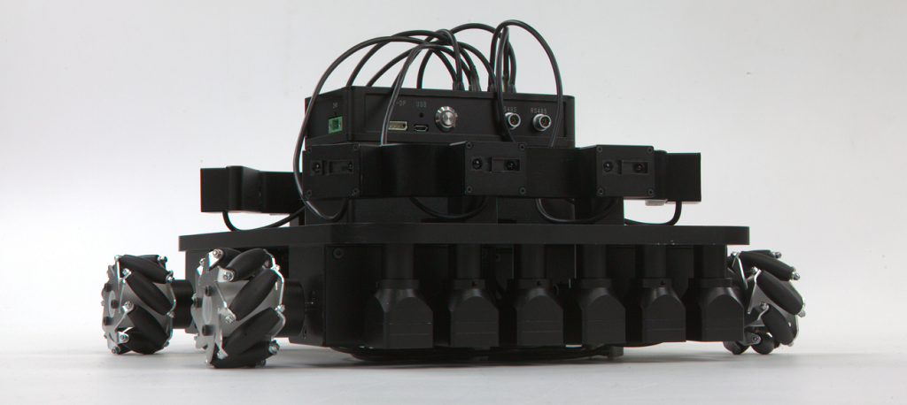

# 启智模块化机器人套件开放源码
#
## 代码下载
点击右上角的“Clone and download”按钮并选择“Download ZIP”，下载“wpb_stm32-master.zip”，解压即可。

## 平台介绍
启智模块机器人是[北京六部工坊科技有限公司](http://www.6-robot.com)推出的一款侧重机器人底层硬件教学的模块化套件，采用免螺丝的独特装配方式，缩短装配手工时间，学习的重点集中于结构设计、程序编写和功能实现上。在有限的实验课时里快速体验和学习各种机器人构型的优缺点和控制特性，为将来深入学习机器人学打好坚实基础。

----------
启智模块机器人套件采用“模块化”的设计理念，传感器和执行器可以通过结构件产生多种组合。其中底盘结构可以组建常见的四轮和三轮结构，且电机末端可更换多种不同类型的轮系结构，极其适合进行各种类型的机器人运动学模型实验。

启智模块机器人套件的结构件均为高强度铝合金，具有结构形变小，抗压性强的优点，无论组装构型的复杂度多少，都具有较好的稳定性。传感器和执行器模块也都安装铝合金外壳，最大限度的保护内部电路免受静电和灰尘的污染。
启智模块机器人套件的结构模块之间连接方式采用独创“MNT”磁力拼装接口设计，其主要特点：

- 插接式配合，接口采用特殊引导工艺，靠近便可轻易滑入，手感极佳。
- 强磁吸合，拼接后自动锁位，无需螺丝，瞬间固定。
- 拆卸时，只需定向稍加外力，即可解锁。

这种新型的拼装接口是专门为了工程实训课程的应用特点所设计的，充分考虑到课程的课时及器材的使用体验与维护难度，其主要意义为：

- 无需螺丝即可实现传感器模块、执行器模块与结构件的快速拆装，在有限课时内可以对构型进行多次改装迭代。
- 减少机械化的螺丝拆装时间，使学生专注于技术开发和排错能力的训练，保持思绪灵活，提高实训效果。
- 拼装结构件易于复原与收纳，大幅降低课后规整的工作量和设备维护难度，减少器材损耗，避免频繁的设备故障和丢件影响到实验课程安排。

启智模块机器人的执行器使用总线式串联，理论上可以挂载上百个执行单元，扩展性极佳，为大型构型的实现，预留了充足的空间。在标准版本中，主要执行器为伺服电机模块，采用进口直流电机，光电编码器闭环控制，在有效负载内均能保持匀速运动，完善的电流保护功能，避免过流过热造成的硬件损坏。启智模块机器人使用不同的轮子、执行器、从动轮支架，可组合成实现两轮差动、四轮差动、三轮全向，四轮全向平台。

